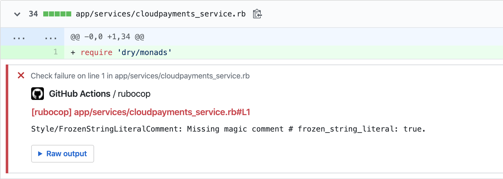
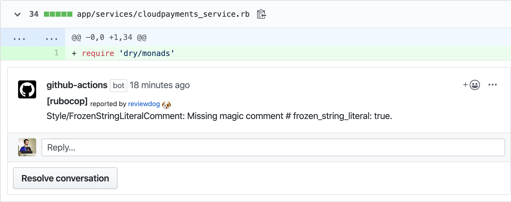

# GitHub Action: Run rubocop with reviewdog 🐶

[](./LICENSE)
[](https://github.com/reviewdog/action-rubocop/actions?query=workflow%3Adepup)
[](https://github.com/reviewdog/action-rubocop/actions?query=workflow%3Arelease)
[](https://github.com/reviewdog/action-rubocop/releases)
[](https://github.com/haya14busa/action-bumpr)

This action runs [rubocop](https://github.com/rubocop/rubocop) with
[reviewdog](https://github.com/reviewdog/reviewdog) on pull requests to improve
code review experience.

## Examples

### With `github-pr-check`

By default, with `reporter: github-pr-check` an annotation is added to the line:



### With `github-pr-review`

With `reporter: github-pr-review` a comment is added to the Pull Request Conversation:



## Inputs

### `github_token`

`GITHUB_TOKEN`. Default is `${{ github.token }}`.

### `rubocop_version`

Optional. Set rubocop version. Possible values:
* empty or omit: install latest version
* `gemfile`: install version from Gemfile (`Gemfile.lock` should be presented, otherwise it will fallback to latest bundler version)
* version (e.g. `0.90.0`): install said version

### `rubocop_extensions`

Optional. Set list of rubocop extensions with versions.

By default install `rubocop-rails`, `rubocop-performance`, `rubocop-rspec`, `rubocop-i18n`, `rubocop-rake` with latest versions.
Provide desired version delimited by `:` (e.g. `rubocop-rails:1.7.1`)

Possible version values:
* empty or omit (`rubocop-rails rubocop-rspec`): install latest version
* `rubocop-rails:gemfile rubocop-rspec:gemfile`: install version from Gemfile (`Gemfile.lock` should be presented, otherwise it will fallback to latest bundler version)
* version (e.g. `rubocop-rails:1.7.1 rubocop-rspec:2.0.0`): install said version

You can combine `gemfile`, fixed and latest bundle version as you want to.

### `rubocop_flags`

Optional. Rubocop flags. (rubocop `<rubocop_flags>`).

### `tool_name`

Optional. Tool name to use for reviewdog reporter. Useful when running multiple
actions with different config.

### `level`

Optional. Report level for reviewdog [`info`, `warning`, `error`].
It's same as `-level` flag of reviewdog.

### `reporter`

Optional. Reporter of reviewdog command [`github-pr-check`, `github-check`, `github-pr-review`].
The default is `github-pr-check`.

### `filter_mode`

Optional. Filtering mode for the reviewdog command [`added`, `diff_context`, `file`, `nofilter`].
Default is `added`.

### `fail_on_error`

Optional.  Exit code for reviewdog when errors are found [`true`, `false`].
Default is `false`.

### `reviewdog_flags`

Optional. Additional reviewdog flags.

### `workdir`

Optional. The directory from which to look for and run Rubocop. Default `.`.

### `skip_install`

Optional. Do not install Rubocop or its extensions. Default: `false`.

### `use_bundler`

Optional. Run Rubocop with bundle exec. Default: `false`.

## Example usage

You can create [RuboCop Configuration](https://docs.rubocop.org/rubocop/configuration.html) and this action uses that config too.

```yml
name: reviewdog
on: [pull_request]
permissions:
  contents: read
  pull-requests: write
jobs:
  rubocop:
    name: runner / rubocop
    runs-on: ubuntu-latest
    steps:
      - name: Check out code
        uses: actions/checkout@v1
      - uses: ruby/setup-ruby@v1
        with:
          ruby-version: 3.0.0
      - name: rubocop
        uses: reviewdog/action-rubocop@v2
        with:
          rubocop_version: gemfile
          rubocop_extensions: rubocop-rails:gemfile rubocop-rspec:gemfile
          reporter: github-pr-review # Default is github-pr-check
```

## Sponsor

<p>
  <a href="https://evrone.com/?utm_source=github&utm_campaign=action-rubocop">
    
  </a>
</p>

## License

[MIT](https://choosealicense.com/licenses/mit)
